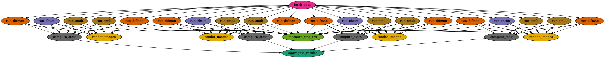

# EHT M87 Black Hole Imaging Workflow

A Pegasus WMS workflow that reproduces the first image of the M87\* black
hole from the Event Horizon Telescope's public 2017 data release — built
clean-room from **EHT Collaboration sources only** (see `SPEC.md` for scope
and `CLAUDE.md` for the sourcing rules).

## Pipeline

```
fetch_data (2019-D01-01 uvfits + SHA-256 verification)
    │
    ├── per day (April 5 / 6 / 10 / 11, 2017):
    │     ├── difmap_lo, difmap_hi     (DIFMAP CLEAN, per band)
    │     ├── ehtim                    (eht-imaging RML, lo+hi)
    │     ├── smili_lo, smili_hi       (SMILI RML, per band)
    │     ├── render  → m87_<day>_panel.png
    │     └── stats   → stats_<day>.json  (closure χ²_CP, χ²_logCA)
    │
    ├── aggregate → stats_summary.csv + summary_report.md
    └── measure_ring_rex (all 20 images) → ring_rex.csv
          (REx — the EHT's own ring extractor, Paper IV §9)
```

The three imaging jobs run the EHT's own fiducial driver scripts, vendored
verbatim in `eht-pipelines/` (pinned commit — see
`eht-pipelines/PROVENANCE.md`). Everything else (`bin/`, `Apptainer/`) is
written for this project.



## Prerequisites

- Pegasus WMS + HTCondor (or a Kiso-provisioned site)
- Apptainer on the submit host (to build) and on the worker nodes (to run)
- Containers (build once; no registry push, Pegasus stages the `.sif` files):

```sh
apptainer build Apptainer/eht-difmap.sif Apptainer/eht-difmap.def
apptainer build Apptainer/eht-ehtim.sif  Apptainer/eht-ehtim.def
apptainer build Apptainer/eht-smili.sif  Apptainer/eht-smili.def
apptainer build Apptainer/eht-rex.sif    Apptainer/eht-rex.def
```

`workflow_generator.py` resolves each container as `<sif-dir>/eht-<name>.sif`,
and `--sif-dir` defaults to `Apptainer/` — so the filenames above matter. Pass
`--sif-dir ''` to fall back to pulling `docker://kthare10/eht-*:latest` from
Docker Hub instead.

`./deploy_pegasus.sh` does the whole sequence: builds any missing `.sif`,
generates the workflow for `condorpool` (override with `EXEC_SITE=...`), then
runs `pegasus-plan --submit` itself.

**Apptainer cannot build on macOS**, and a `.sif` has no multi-arch manifest —
one file, one architecture. `eht-smili` and `eht-ehtim` in particular compile
NFFT and SMILI from source, so build them on a Linux host matching the worker
nodes. See [`APPTAINER.md`](APPTAINER.md). The legacy `Docker/*_Dockerfile`
files are kept as a fallback.

<details>
<summary>Optional: publish the image to ghcr.io</summary>

Useful for sharing one build across a team or citing an immutable artifact. Needs a
GitHub token with `write:packages`.

```bash
echo "$GHCR_TOKEN" | apptainer registry login --username <github-user> \
    --password-stdin oras://ghcr.io

TAG=$(git rev-parse --short HEAD)
apptainer push Apptainer/eht-difmap.sif \
    oras://ghcr.io/kthare10/eht-workflow-eht-difmap:$TAG
apptainer push Apptainer/eht-ehtim.sif \
    oras://ghcr.io/kthare10/eht-workflow-eht-ehtim:$TAG
apptainer push Apptainer/eht-rex.sif \
    oras://ghcr.io/kthare10/eht-workflow-eht-rex:$TAG
apptainer push Apptainer/eht-smili.sif \
    oras://ghcr.io/kthare10/eht-workflow-eht-smili:$TAG

# On the submit host, pull back to the path the generator expects
apptainer pull Apptainer/eht-difmap.sif \
    oras://ghcr.io/kthare10/eht-workflow-eht-difmap:$TAG
apptainer pull Apptainer/eht-ehtim.sif \
    oras://ghcr.io/kthare10/eht-workflow-eht-ehtim:$TAG
apptainer pull Apptainer/eht-rex.sif \
    oras://ghcr.io/kthare10/eht-workflow-eht-rex:$TAG
apptainer pull Apptainer/eht-smili.sif \
    oras://ghcr.io/kthare10/eht-workflow-eht-smili:$TAG
```

Four images, four package names. The pull filenames matter — the generator
resolves `<sif-dir>/eht-<name>.sif`.

Do **not** put the `oras://` URL in the transformation catalog — Pegasus supports
`docker://`, `shub://`, `library://`, `shifter://` and `file://`, not `oras://`.
Treat ghcr.io as a distribution channel and keep staging the local `.sif`. Details in
[`APPTAINER.md`](APPTAINER.md).

</details>

## Usage

```sh
# Generate the DAG (all 4 days, all 3 pipelines + ring measurement: 31 jobs)
python3 workflow_generator.py --output workflow.yml

# Smaller test: one day, no SMILI, on a plain HTCondor pool with no site catalog
python3 workflow_generator.py --days 101 --skip-smili -e condorpool --output workflow.yml

# The generator never plans or submits; it prints this command
pegasus-plan --dir submit -s condorpool -o local --output-dir "$PWD/output" --submit workflow.yml
pegasus-status <run-dir>
```

Options: `--days {095,096,100,101}`, `--skip-difmap`, `--skip-ehtim`,
`--skip-smili`, `--smili-nproc N`, `--sif-dir DIR`, `-o/--output FILE`, and the
site options below.

### Sites

Following [pegasus-gromacs](https://github.com/pegasus-isi/pegasus-gromacs),
jobs run on a site named `compute`, and the generator writes no site catalog —
where jobs run depends on your resource and allocation:

| Option | Default | Description |
|--------|---------|-------------|
| `-s`, `--hosted-site-catalog` | (none; `~/.pegasusrc` if set) | [Hosted site catalog](https://github.com/pegasushub/pegasus-site-catalogs/tree/main/conf) to plan against, e.g. `access-pegasus.yml`, `unity.yml` |
| `-e`, `--execution-site-name` | `compute` | Execution site name; `condorpool` on a plain HTCondor pool with no site catalog |

Without `-s`, `pegasus-plan` uses the catalog named in `~/.pegasusrc`
(`pegasus.catalog.site.repo.file`). On a plain HTCondor pool with no catalog,
generate with `-e condorpool`: Pegasus builds a default `condorpool` site
itself. Pass `--output-dir` to `pegasus-plan` to choose where outputs land;
otherwise Pegasus's default local site puts them in `wf-output/` next to the
submit directory.

The notebook [`EHT-M87-Workflow.ipynb`](EHT-M87-Workflow.ipynb) drives the same
`EHTWorkflow` class interactively — generate, view the DAG, plan and submit
(an explicit cell; `create_sites_catalog()` writes a local HTCondor `compute`
site for it), monitor, and look at the images:

```sh
jupyter lab EHT-M87-Workflow.ipynb
```

## Outputs (in `output/`)

| File | Content |
|---|---|
| `checksums_manifest.txt` | SHA-256 of every downloaded input (validation V1/V6) |
| `difmap_<day>_<band>.fits` / `.stat` | DIFMAP CLEAN image + fit statistics |
| `ehtim_<day>.fits` | eht-imaging reconstruction (lo+hi) |
| `smili_<day>_<band>.fits` | SMILI reconstruction |
| `m87_<day>_panel.png` | Side-by-side panel of all reconstructions |
| `stats_<day>.json` | Closure χ² per image vs both bands |
| `stats_summary.csv`, `summary_report.md` | Aggregate vs EHT Paper IV Table 5 |
| `ring_rex.csv` | REx ring diameter/width/orientation/asymmetry per image (V2/V3) |

## Validation

Expected result: a ~42 μas ring, brighter in the south, on every day from
every pipeline, with closure χ² consistent with EHT Paper IV Table 5.
Full criteria in `SPEC.md` §6; the post-hoc comparison against the
reproducibility literature is in `COMPARISON.md` (§7), based on a
five-iteration campaign whose per-run outputs, checksums, wf_uuids, and
container digests are archived under `results5/`. Repeat it with
`./run_iterations.sh 5` and `bin/aggregate_multirun.py results5`.

## Local smoke test

`./run_manual.sh` runs fetch + eht-imaging + render + stats for one day
without Pegasus (inside the ehtim container or a matching venv).

## License

Apache License 2.0 (see `LICENSE`) for everything written for this project
(`workflow_generator.py`, `bin/`, `Apptainer/`, `Docker/`, scripts, documentation).
The vendored EHT pipeline files in `eht-pipelines/` are the EHT
Collaboration's own and remain under **GPLv3** per their headers — the
full GPLv3 text is included at `eht-pipelines/LICENSE` as its terms
require (see `eht-pipelines/PROVENANCE.md` for origin and pinning).
